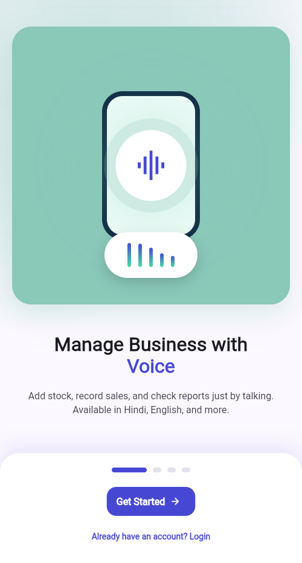
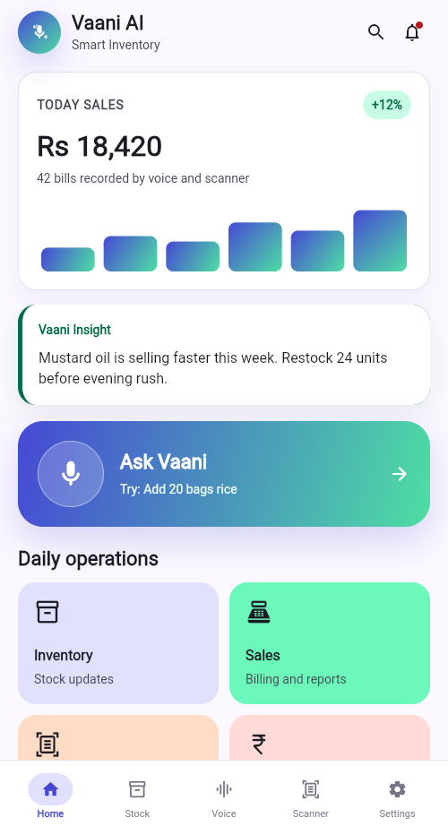
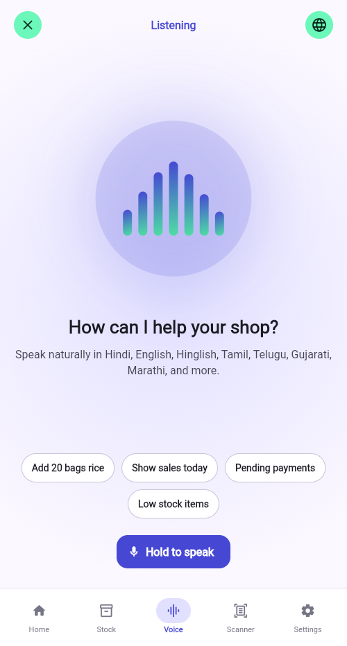
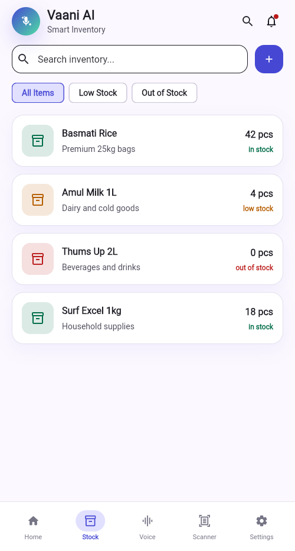
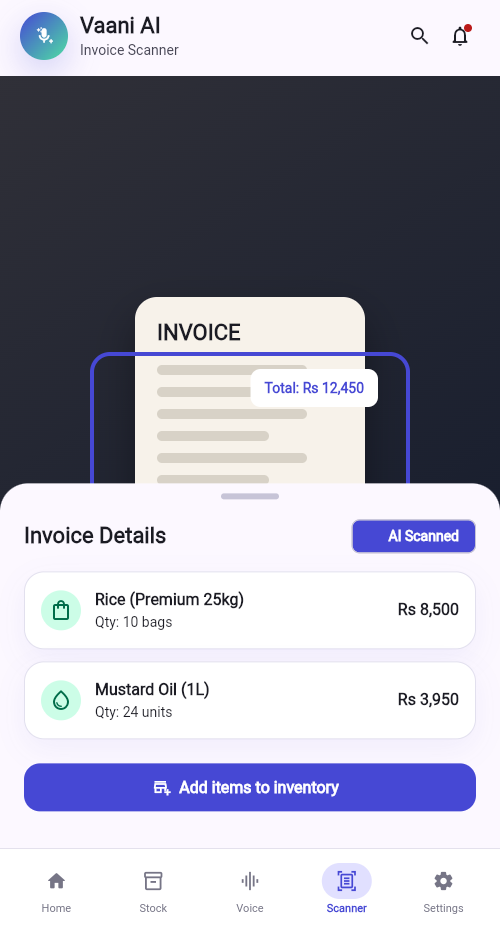
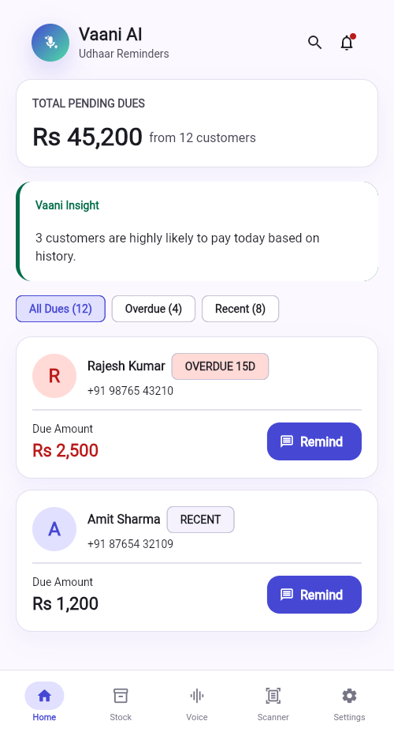
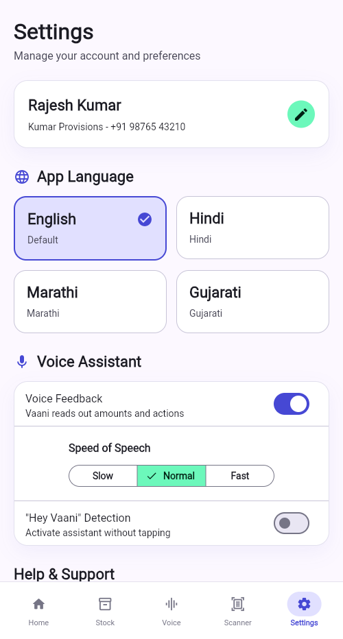

# Vaani AI

Vaani AI is a multilingual AI voice assistant for small businesses in India. It helps merchants manage inventory, sales, invoice scanning, and payment reminders through simple voice-first workflows in English, Hindi, Tamil, Telugu, Bengali, Marathi, Kannada, Malayalam, Punjabi, Gujarati, and Hinglish.

## Current Status

This repository is a production-oriented Flutter/Firebase foundation, not a complete production-ready app yet.

Implemented so far:

- Flutter app scaffold with Material 3 UI.
- Android platform project scaffold for debug builds and device installs.
- Branded Vaani AI app icon, web favicon, and in-app brand mark.
- Stitch-inspired mobile UI flow with animated onboarding, dashboard, voice, inventory, scanner, payments, and settings screens.
- Feature-first clean architecture structure.
- Riverpod dependency wiring.
- GoRouter navigation.
- Firebase-ready repository layer.
- Auth repository contracts and Firebase auth implementation.
- Inventory domain model and Firestore repository.
- Voice engine abstraction with speech-to-text and text-to-speech implementation.
- AI intent classification layer with deterministic shortcuts and remote AI client wrappers.
- Offline sync queue foundation.
- Firebase Firestore and Storage security rules.
- CI workflow for format, analyze, tests, and Firebase rule deployment.
- Supporting project summary, problem statement, AI features, architecture, testing strategy, project structure, and DevOps documentation.
- Starter unit tests for AI intent mapping and inventory stock logic.

Still required before production:

- Firebase project configuration through FlutterFire CLI.
- Full authentication UX and platform OAuth setup.
- Complete inventory CRUD screens and local SQLite persistence.
- Sales transaction workflows, reports, PDF export, and Excel export.
- OCR camera flow, invoice parsing, GST validation, and review UI.
- Payment reminders through Cloud Functions, WhatsApp, SMS, and email providers.
- Cloud Functions gateway for OpenAI, Gemini, and provider secrets.
- App Check, Crashlytics, Analytics dashboards, release signing, and monitoring.
- Emulator-backed Firebase security rule tests.
- Integration tests and broader widget coverage.

## Visual Flow

The current app flow is designed around a mobile-first merchant journey:

```text
Onboarding -> Home Dashboard -> Voice Assistant -> Inventory / Scanner / Udhaar / Settings
```

| Onboarding | Home Dashboard |
| --- | --- |
|  |  |

| Voice Assistant | Inventory |
| --- | --- |
|  |  |

| Invoice Scanner | Udhaar Reminders |
| --- | --- |
|  |  |

| Settings |
| --- |
|  |

## Mobile Interaction

- The home dashboard is the daily command center.
- The `Ask Vaani` action opens a modal voice assistant sheet, so the user does not lose dashboard context.
- Bottom navigation provides quick movement between home, stock, voice, scanner, and settings.
- Inventory stock updates use a bottom sheet pattern for quick in-place edits.
- The scanner screen uses an animated scan preview and review sheet before inventory creation.

## Tech Stack

- Flutter and Dart
- Riverpod
- GoRouter
- Firebase Auth
- Cloud Firestore
- Firebase Storage
- Firebase Messaging
- Firebase Analytics
- Firebase Crashlytics
- Hive
- SQLite
- Dio
- Speech-to-text
- Text-to-speech
- Google ML Kit OCR
- Gemini and OpenAI gateway clients

## Project Structure

```text
lib/
  app/                  App shell, router, and theme.
  core/
    bootstrap/          App startup initialization.
    errors/             Typed exceptions.
    localization/       Supported language metadata.
    security/           Secure storage wrapper.
    sync/               Offline operation queue and sync engine.
  features/
    ai/                 Intent classification and AI client contracts.
    auth/               Firebase auth repository and login screen.
    dashboard/          Voice-first dashboard UI.
    inventory/          Product model, repository, providers, and screen.
    ocr/                Invoice OCR result model and scanner screen shell.
    payments/           Payment reminder model and screen shell.
    sales/              Sale model and sales screen shell.
    voice/              Device speech and TTS engine.
android/                Android app shell, manifests, Gradle config, and launch assets.
test/                   Unit tests.
docs/                   Project summary, problem statement, AI features, architecture, DevOps, testing, and structure docs.
```

For more detail, see:

- [Project summary](docs/project-summary.md)
- [Problem statement](docs/problem-statement.md)
- [AI features](docs/ai-features.md)
- [Architecture](docs/architecture.md)
- [Project structure](docs/project-structure.md)
- [Testing strategy](docs/testing.md)
- [DevOps](docs/devops.md)

## Getting Started

Install dependencies:

```bash
flutter pub get
```

Run static analysis:

```bash
flutter analyze
```

Run tests:

```bash
flutter test
```

Run the app:

```bash
flutter run
```

Run on a specific Android device:

```bash
flutter devices
flutter run -d <device-id>
```

Build a debug Android APK:

```bash
flutter build apk --debug
```

If `flutter run` builds successfully but hangs while attaching to a connected device, install and launch the debug APK directly:

```bash
adb -s <device-id> install -r build/app/outputs/flutter-apk/app-debug.apk
adb -s <device-id> shell monkey -p com.vaani.ai -c android.intent.category.LAUNCHER 1
```

## Firebase Setup

1. Create separate Firebase projects for development, staging, and production.
2. Install the FlutterFire CLI.
3. Run:

```bash
flutterfire configure
```

4. Enable Firebase Auth providers:
   - Email/password
   - Google
   - Phone OTP
5. Enable Firestore, Storage, Cloud Messaging, Analytics, and Crashlytics.
6. Deploy rules and indexes:

```bash
firebase deploy --only firestore:rules,firestore:indexes,storage:rules
```

## Security

- Do not ship OpenAI, Gemini, SMS, WhatsApp, email, or payment provider secrets in the Flutter app.
- Route sensitive provider calls through Cloud Functions.
- Store secrets with Firebase Secret Manager or an equivalent managed vault.
- Enforce Firebase App Check before production release.
- Validate every AI tool-call payload before mutating business data.
- Use Firebase emulator tests for security rules before deployment.

## Verification

Last verified locally:

```text
dart format lib test
flutter analyze
flutter test
flutter build apk --debug
adb install and launch on I2305 Android device
```

Result:

```text
No analyzer issues.
All tests passed.
Debug APK built, installed, and launched on a connected Android device.
```

## License

Private startup project. Add a license before open-sourcing.
