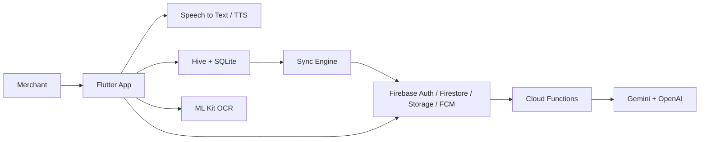
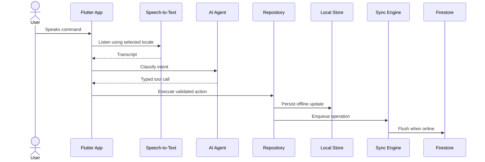
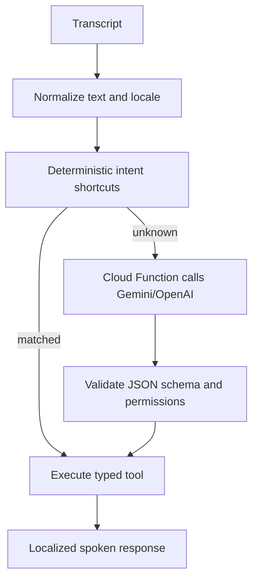

# Vaani AI Architecture

## Validation

The product should be delivered as an offline-first Flutter app backed by Firebase. Voice, OCR, AI intent routing, and synchronization are separate capabilities because each has different latency, privacy, failure, and testability requirements.

## Key Risks

- Voice recognition quality varies by device, noise, accent, and language. Keep deterministic command shortcuts before LLM routing.
- LLM responses must never directly mutate data. Convert model output into typed tool calls and validate every argument.
- Firebase keys are public identifiers. Provider secrets, OpenAI keys, Gemini keys, SMS credentials, and WhatsApp tokens must live in Cloud Functions or a secure server-side vault.
- Offline writes need idempotent operation IDs and conflict rules. Last-write-wins is acceptable for profile data, but inventory requires quantity deltas.
- OCR extraction must be reviewed before inventory creation because GST invoices vary widely.

## High-Level Architecture



## Voice Command Data Flow



## AI Workflow



## Firestore Model

- `businesses/{businessId}`: owner, GST profile, address, subscription, settings.
- `businesses/{businessId}/members/{uid}`: role, permissions, status.
- `businesses/{businessId}/products/{productId}`: inventory item, stock, GST, barcode, low-stock threshold.
- `businesses/{businessId}/sales/{saleId}`: sale header and embedded line items.
- `businesses/{businessId}/paymentReminders/{reminderId}`: due amount, channel, schedule, status.
- `businesses/{businessId}/ocrInvoices/{invoiceId}`: Storage path, raw text, extracted fields, review status.
- `businesses/{businessId}/syncAudit/{operationId}`: optional audit trail for conflict diagnosis.

## Local Storage

Hive boxes:

- `sync_queue`: pending `SyncOperation` records.
- `voice_memory`: recent transcripts and resolved intents, capped per business.
- `settings`: selected language, app mode, accessibility preferences.

SQLite tables:

```sql
CREATE TABLE products (
  id TEXT PRIMARY KEY,
  business_id TEXT NOT NULL,
  name TEXT NOT NULL,
  search_name TEXT NOT NULL,
  category TEXT NOT NULL,
  quantity REAL NOT NULL,
  unit TEXT NOT NULL,
  low_stock_threshold REAL NOT NULL,
  barcode TEXT,
  gst_rate REAL,
  selling_price REAL,
  updated_at TEXT NOT NULL
);

CREATE TABLE sales (
  id TEXT PRIMARY KEY,
  business_id TEXT NOT NULL,
  total REAL NOT NULL,
  currency TEXT NOT NULL,
  customer_name TEXT,
  created_at TEXT NOT NULL
);

CREATE TABLE sale_items (
  id INTEGER PRIMARY KEY AUTOINCREMENT,
  sale_id TEXT NOT NULL,
  product_id TEXT NOT NULL,
  name TEXT NOT NULL,
  quantity REAL NOT NULL,
  unit_price REAL NOT NULL,
  FOREIGN KEY (sale_id) REFERENCES sales(id)
);
```

## Production Readiness Checklist

- Configure Firebase using FlutterFire CLI and remove bootstrap fallback for release builds.
- Move AI, WhatsApp, SMS, and email credentials into Cloud Functions secrets.
- Add App Check, Crashlytics, Analytics, and alerting dashboards.
- Add emulator-backed security rule tests.
- Add golden tests for mobile-first screens and integration tests for voice command flows.
- Run load tests for Cloud Functions used by AI intent routing.
